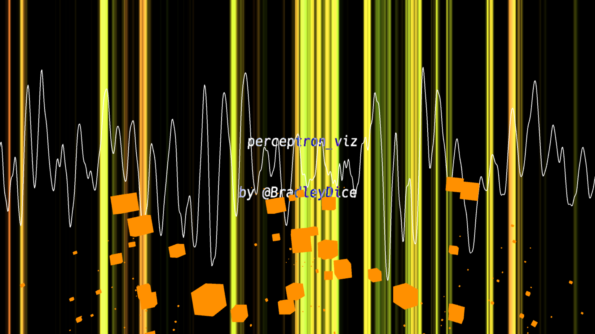
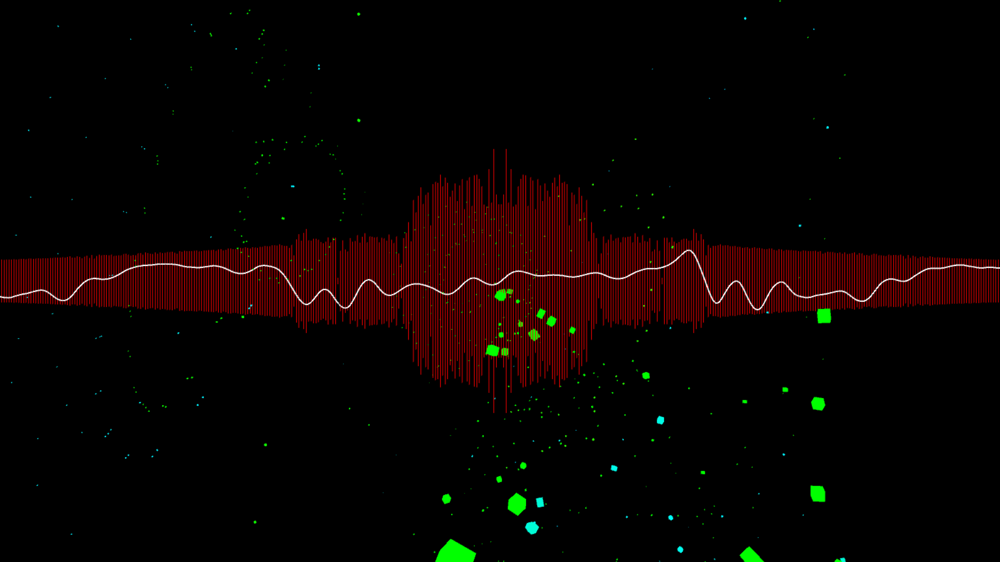

# perceptron-viz

Audio-reactive visualizer written in [Processing](https://processing.org/), designed for the [Michigan Electronic Music Collective](https://www.facebook.com/memcollective/).

Originally based on Ben Farahmand's [Atomic Sprocket visualizer](https://gist.github.com/benfarahmand/6902359#file-audio-visualizer-atomic-sprocket).

## Screenshots

